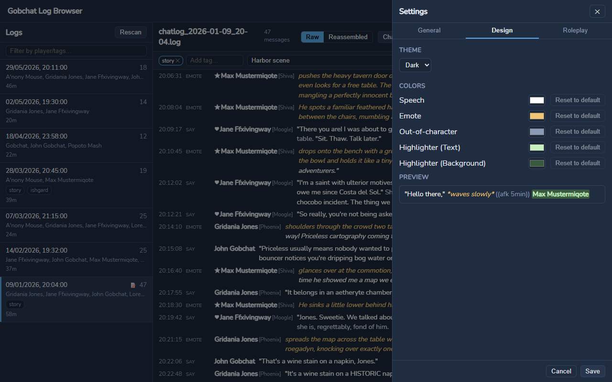

<div align="center">


# Gobchat Log Browser

**Durchsuche und durchstöbere deine Final-Fantasy-XIV-Rollenspiel-Chatlogs aus [Gobchat](https://github.com/MarbleBag/Gobchat).**

[](https://go.dev/)
[](https://wails.io/)
[](https://vuejs.org/)
[](LICENSE)

🇬🇧 [English version](README.md)

</div>

---

## Worum geht's?

[Gobchat](https://github.com/MarbleBag/Gobchat) ist ein Chat-Overlay für Final Fantasy XIV, das Unterhaltungen in Textdateien mitschreiben kann. Mit der Zeit sammeln sich diese `chatlog_*.log`-Dateien an — und *diese eine Szene* von vor drei Monaten wiederzufinden wird zur Geduldsprobe.

Der **Gobchat Log Browser** ist eine Desktop-App, die aus diesen Log-Dateien ein durchsuchbares, filterbares Archiv macht:

- Der Gobchat-Log-Ordner (`%APPDATA%\Gobchat\log`) wird automatisch erkannt; eigene Verzeichnisse lassen sich zusätzlich hinzufügen.
- Deine Log-Dateien werden **strikt nur gelesen** — die App verändert, verschiebt oder überschreibt sie niemals.
- Alles Weitere (Tags, Notizen, Einstellungen, Metadaten-Cache) liegt getrennt davon in `%APPDATA%\GobchatLogBrowser`.

## Screenshots

| Log-Liste & Filter | Log-Ansicht |
| --- | --- |
|  |  |
| **Suche** | **Einstellungen** |
|  |  |

*Aufgenommen mit den KI-generierten [Beispiel-Logs](docs/examples/mock-logs/) — keine echten Spielerdaten.*

## Funktionen

- **Log-Übersicht** — alle Logs auf einen Blick mit Datum, Teilnehmern, Nachrichtenanzahl und Dauer.
- **Rollenspiel-Hervorhebung** — Sprache, Emotes und Out-of-Character-Text werden farblich markiert; die Marker sind konfigurierbar und entsprechen standardmäßig den Gobchat-Konventionen.
- **Roh- & zusammengefügte Ansicht** — zeige ein Log in der ursprünglichen Dateireihenfolge an oder lass die App unterbrochene, mehrteilige Nachrichten (`(1/2)`, abschließendes `>`, `->`, `>>`, `+`, …) wieder zusammenfügen, inklusive Start- und Endzeit jedes Posts. Das Zusammenfügen ist eine Best-Effort-Heuristik und passiert ausschließlich im Speicher — Dateien werden nie verändert.
- **Überall suchen** — Volltextsuche über alle Logs sowie Suche im aktuellen Log mit Treffer-Navigation (Enter / Umschalt+Enter) und Treffer-Markierungen auf der Scrollleiste.
- **Spieler- & Tag-Filter** — filtere die Log-Liste nach Teilnehmern und `#Tags` (UND-verknüpft); deine eigenen Rollenspiel-Charaktere bleiben oben angepinnt, und Tag-Chips in der Liste sind klickbar.
- **Highlighter** — Zeilen hervorheben, in denen deine Charakternamen vorkommen.
- **Tags & Notizen** — versieh Logs mit Tags und Notizen; gespeichert als JSON-Sidecar-Dateien, niemals in den Log-Dateien selbst.
- **Welten-Schalter** — blende `[Welt]`-Zusätze hinter Spielernamen mit einem Klick aus.
- **Live-Aktualisierung** — die Log-Liste aktualisiert sich automatisch, während Gobchat neue Logs schreibt.
- **Schneller Start** — dank persistentem Metadaten-Index öffnen sich auch große Log-Sammlungen zügig.
- **Opt-in-Update-Prüfung** — werde über neue Versionen informiert; es wird nichts automatisch heruntergeladen.
- **Einrichtungsassistent beim ersten Start, dunkles & helles Design mit anpassbaren Hervorhebungsfarben, Oberfläche auf Deutsch & Englisch.**

## Erste Schritte

> **Plattform-Unterstützung:** Windows ist die unterstützte und getestete Plattform. Der Code ist plattformunabhängig, Linux-/macOS-Builds sollten funktionieren, sind aber derzeit ungetestet.

Lade die aktuelle Version von der [Releases-Seite](https://github.com/Shuro/Gobchat-Log-Browser/releases/latest) herunter:

- **Installer (empfohlen):** `gobchat-log-browser-vX.Y.Z-windows-amd64-installer.exe` — installiert pro Benutzer nach `%LOCALAPPDATA%\GobchatLogBrowser` (keine Admin-Rechte nötig) und legt Startmenü- und Desktop-Verknüpfungen an. Beim Deinstallieren über Windows-Einstellungen → Apps bleiben Tags, Notizen und Einstellungen erhalten.
- **Portabel:** `gobchat-log-browser-vX.Y.Z-windows-amd64-portable.zip` — irgendwo entpacken und die Exe direkt starten.

> **SmartScreen-Warnung:** Die Binärdateien sind nicht code-signiert, daher zeigt Windows beim ersten Start eventuell *„Der Computer wurde durch Windows geschützt"* an. Klicke auf **Weitere Informationen → Trotzdem ausführen**. Das ist bei kleinen Open-Source-Tools ohne (kostenpflichtiges) Signaturzertifikat normal.

Aus dem Quellcode bauen (siehe unten) funktioniert ebenfalls, ist aber optional.

1. Starte die Anwendung. Beim ersten Start fragt ein kurzer Einrichtungsassistent nach Sprache, Design und Log-Ordner.
2. Ist Gobchat installiert, wird dessen Log-Ordner automatisch erkannt — einfach bestätigen.
3. Wähle links ein Log aus und lies los. Das war's.

**Voraussetzungen:** Windows 10/11 mit der [WebView2-Runtime](https://developer.microsoft.com/de-de/microsoft-edge/webview2/) (auf Windows 11 und aktuellen Windows-10-Systemen vorinstalliert).

## Aus dem Quellcode bauen

Voraussetzungen:

- [Go](https://go.dev/dl/) 1.23+
- [Node.js](https://nodejs.org/) (mit npm)
- [Wails CLI v2](https://wails.io/docs/gettingstarted/installation): `go install github.com/wailsapp/wails/v2/cmd/wails@latest`

```bash
# Entwicklung mit Hot Reload
wails dev

# Produktions-Build → build/bin/gobchat-log-browser.exe
wails build
```

Tests ausführen:

```bash
go test ./...                      # Backend
cd frontend && npm run build       # Typprüfung + Frontend-Build
```

## Architektur

Das Backend (Go) übernimmt alles Schwere: Parsen des Gobchat-Log-Formats, Tokenisierung der Rollenspiel-Abschnitte, Suchindex, Datei-Überwachung und Metadaten-Cache. Das Frontend (Vue 3 + TypeScript + Pinia) ist eine schlanke, virtualisierte Oberfläche darüber, angebunden über Wails-Bindings.

Designentscheidungen sind als ADRs in [docs/adr/](docs/adr/) dokumentiert — unter anderem, warum Logs nur gelesen werden und warum das Zusammenfügen von Nachrichten heuristisch und rein für die Anzeige ist.

## Lizenz

Lizenziert unter der [Apache License 2.0](LICENSE).

*Der Gobchat Log Browser ist ein Fan-Projekt und steht in keiner Verbindung zu Square Enix oder zum Gobchat-Projekt. Final Fantasy XIV ist eine eingetragene Marke der Square Enix Holdings Co., Ltd.*
