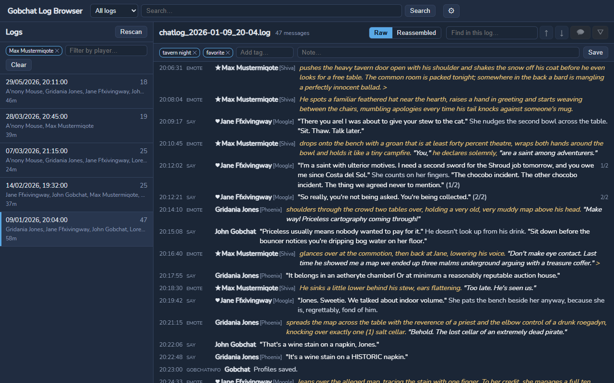
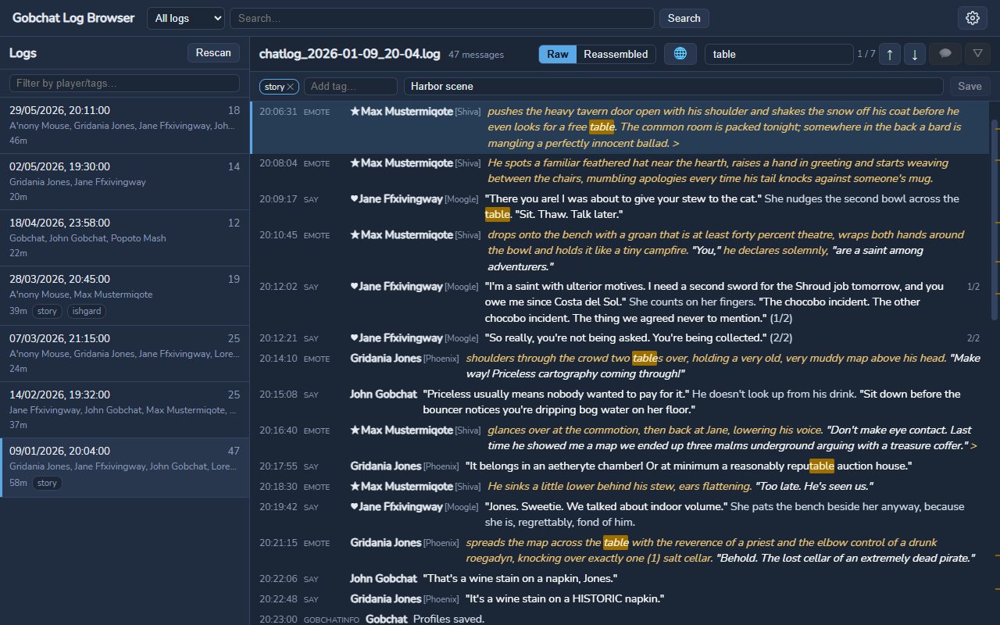
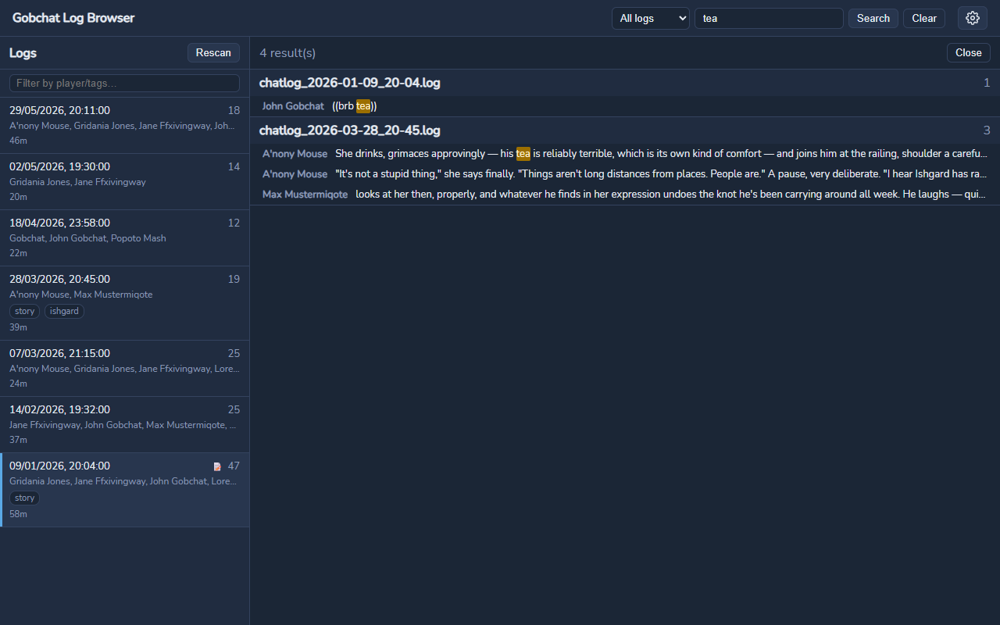

<div align="center">


# Gobchat Log Browser

**Browse and search your Final Fantasy XIV roleplay chat logs from [Gobchat](https://github.com/MarbleBag/Gobchat).**

[](https://go.dev/)
[](https://wails.io/)
[](https://vuejs.org/)
[](LICENSE)

🇩🇪 [Deutsche Version](README.de.md)

</div>

---

## About

[Gobchat](https://github.com/MarbleBag/Gobchat) is a chat overlay for Final Fantasy XIV that can log your conversations to plain-text files. Over time those `chatlog_*.log` files pile up — and finding *that one scene* from three months ago becomes a chore.

**Gobchat Log Browser** is a desktop app that turns those log files into a searchable, filterable archive:

- It auto-detects Gobchat's log folder (`%APPDATA%\Gobchat\log`) or any folders you add yourself.
- Your log files are treated as **strictly read-only** — the app never modifies, moves, or rewrites them.
- All extras (tags, notes, settings, metadata cache) are stored separately in `%APPDATA%\GobchatLogBrowser`.

## Screenshots

<!-- TODO: capture and drop into docs/screenshots/, then uncomment the table:
     - log-list.png    — main window with the log list and player filter
     - log-viewer.png  — an open log with RP highlighting and find-in-log
     - search.png      — global search results across all logs

| Log list & filters | Log viewer | Search |
|---|---|---|
|  |  |  |
-->

*Screenshots coming soon.*

## Features

- **Log overview** — all logs at a glance with date, participants, message count, and duration.
- **Roleplay highlighting** — dialogue, emotes, and out-of-character text are color-coded; the marker characters are configurable and default to Gobchat's conventions.
- **Raw & reassembled views** — view a log in its original file order, or let the app stitch interrupted multi-part messages (`(1/2)`, trailing `>`, …) back together. Reassembly is a best-effort heuristic and happens purely in memory — files are never changed.
- **Search everywhere** — full-text search across all logs, plus find-in-log with match navigation (Enter / Shift+Enter) and match ticks on the scrollbar.
- **Player filter with pinned characters** — filter the log list by participant; your own roleplay characters stay pinned to the top.
- **Mentions** — highlight lines that mention your character names.
- **Tags & notes** — tag logs and attach notes; stored as JSON sidecars, never inside the log files.
- **Live updates** — the log list refreshes automatically while Gobchat writes new logs.
- **Fast startup** — a persistent metadata index means even large log collections open quickly.
- **First-run wizard, dark & light themes, English & German UI.**

## Getting started

> **Platform support:** Windows is the supported and tested platform. The code base is platform-agnostic and Linux/macOS builds should work, but they are currently untested.

Download the latest version from the [releases page](https://github.com/Shuro/Gobchat-Log-Browser/releases/latest):

- **Installer (recommended):** `gobchat-log-browser-vX.Y.Z-windows-amd64-installer.exe` — installs per-user to `%LOCALAPPDATA%\GobchatLogBrowser` (no admin rights needed) and creates Start Menu and desktop shortcuts. Uninstalling via Windows Settings → Apps keeps your tags, notes, and settings.
- **Portable:** `gobchat-log-browser-vX.Y.Z-windows-amd64-portable.zip` — unzip anywhere and run the exe directly.

> **SmartScreen warning:** the binaries are not code-signed, so Windows may show *"Windows protected your PC"* on first run. Click **More info → Run anyway**. This is expected for small open-source tools without a (paid) signing certificate.

Building from source (see below) works too, but is optional.

1. Run the application. On first launch a short setup wizard asks for your language, theme, and log folder.
2. If Gobchat is installed, its log folder is detected automatically — just confirm it.
3. Pick a log from the list and start reading. That's it.

**Requirements:** Windows 10/11 with the [WebView2 runtime](https://developer.microsoft.com/en-us/microsoft-edge/webview2/) (preinstalled on Windows 11 and most up-to-date Windows 10 systems).

## Building from source

Prerequisites:

- [Go](https://go.dev/dl/) 1.23+
- [Node.js](https://nodejs.org/) (with npm)
- [Wails CLI v2](https://wails.io/docs/gettingstarted/installation): `go install github.com/wailsapp/wails/v2/cmd/wails@latest`

```bash
# Development with hot reload
wails dev

# Production build → build/bin/gobchat-log-browser.exe
wails build
```

Running the tests:

```bash
go test ./...                      # backend
cd frontend && npm run build       # type-check + build the frontend
```

## Architecture

The backend (Go) handles everything heavy: parsing the Gobchat log format, roleplay-span tokenization, search indexing, file watching, and metadata caching. The frontend (Vue 3 + TypeScript + Pinia) is a thin, virtualized UI on top, connected through Wails bindings.

Design decisions are recorded as ADRs in [docs/adr/](docs/adr/) — including why logs are read-only and why message reassembly is heuristic and display-only.

## License

Licensed under the [Apache License 2.0](LICENSE).

*Gobchat Log Browser is a fan-made tool and is not affiliated with Square Enix or with the Gobchat project. Final Fantasy XIV is a registered trademark of Square Enix Holdings Co., Ltd.*
